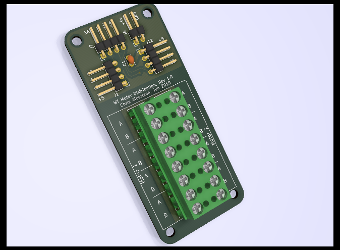

# WTmotorDistribution -- Wide Thumper chassis motor power and encoder distriution board.

This PCB is very simple.  It is basically a termal block for connecting wires.
But there are six moters with large size wires and this PCB reduces the bulk of wires that must
to lead from the sub chass up to the top plate.   

There is a 3D printable plastic enclosure for this PCB. 
The plastic protects the connections and prevents shorts
Look at it or download here: https://a360.co/3aERoY5

